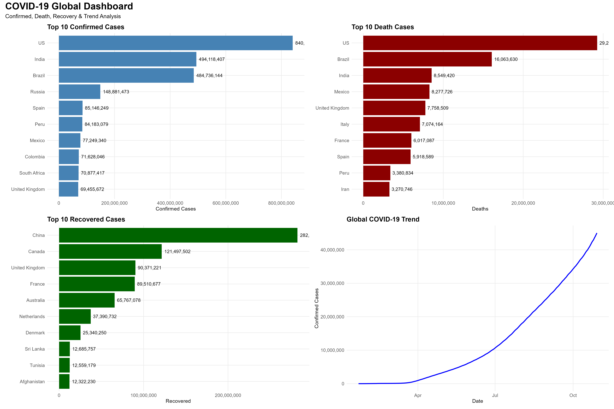
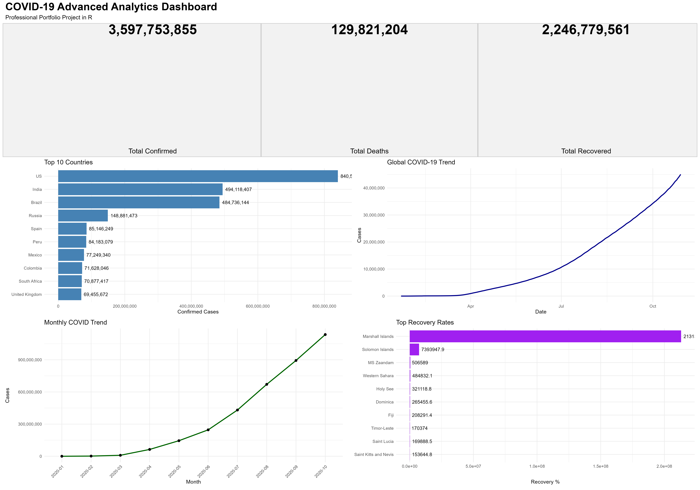

# 🦠 COVID-19 Data Analysis Project Using R

A professional data analytics project built using **R** and **RStudio** to analyze global COVID-19 trends through data cleaning, exploratory data analysis, and dashboard visualizations.

---

# 📊 Project Overview

This project explores real-world COVID-19 data to uncover insights about:

* Confirmed cases worldwide
* Death and recovery trends
* Country-level comparisons
* Global COVID-19 growth patterns
* Recovery rate analysis

The project demonstrates a complete data analytics workflow from raw data to professional dashboard visualizations.

---

# 🛠 Tools & Technologies

* R Programming
* RStudio
* tidyverse
* ggplot2
* dplyr
* lubridate
* patchwork
* scales

---

# 📁 Project Structure

```text
covid19-r-analysis/
│
├── data/                  # Raw dataset
├── scripts/               # R scripts
├── outputs/               # Cleaned datasets
├── plots/                 # Dashboard charts & visualizations
├── reports/               # Reports
└── README.md
```

---

# 📈 Dashboard Features

✔ Professional multi-chart dashboard
✔ KPI summary cards
✔ Top affected countries analysis
✔ Recovery rate analysis
✔ Global trend visualizations
✔ Readable charts with labels

---

# 📊 Example Visualizations

* Top 10 Confirmed Cases
* Top 10 Death Cases
* Recovery Rate Analysis
* Global Trend Charts
* Monthly COVID Trends

---

# 📈 Dashboard Preview

## 1. Professional COVID Dashboard 

[](plots/professional_covid_dashboard.png)

### 2. Advanced COVID Analytics Dashboard


[](plots/advanced_covid_dashboard.png)

---


# 👨‍💻 Author

**Mohamed Cabdirashid Maxamuud**

* Data Analyst
* Business Intelligence Analyst
* AI Automation Developer
* AI, Blockchain & Web3 Enthusiast

---

# ⭐ Support

If you found this project useful, give it a star ⭐ on GitHub.

🔗 Repository:
https://github.com/Mohamed-Abdirashid-tech/covid19-data-analysis-r